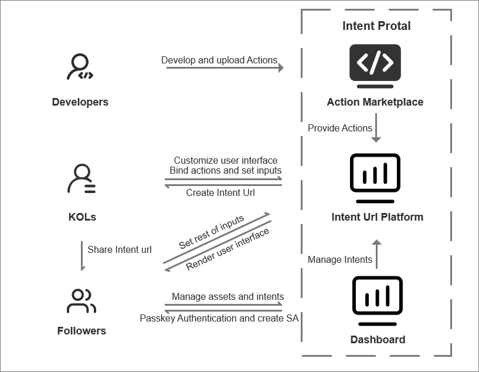

Intent URL is a feature launched by zkLink that converts the act of constructing a transaction into a promotional link (plink). Intent URL is a sharable short link to complete specified action in the zkLink Nova network. User who has the Intent URL can build a certain transaction easily. They can preview, sign the transaction and finally send it to the zkLink Nova network, without understanding the details of the transaction. Intent URL can be used for various on-chain activities such as token swaps, voting, and sponsorship. It greatly lowers the barrier to entry into the blockchain world. More importantly, Intent URl is  short, easy to share on social media and webpage.

## Overview
To understanding Intent URL, we need to comprehend two key terms:

- Action: An Action is a standardized API implementation created by developers. It accepts certain parameters and generates transactions that meet specific needs based on predefined logic.
- Intent URL: It is a shareable short link that serves as the entry point for executing an action. On the page of this short link, users can set a few parameters using selection boxes or input fields. After clicking confirm, they can generate and preview the transaction. If everything is correct, the user can sign and send it to the zkLink Nova network.

## Role

The roles involved in Intent URL include:

- Developer: The role responsible for developing Actions. Developers need to implement the Action specifications and submit the code to the repository. We (zkLink) will register the reviewed Actions.
- Intent Creator: The role responsible for creating Intent URLs. They select a registered Action, configure it, and generate a shareable short link.
- User: The person using the Intent URL. Users do not need to understand complex transaction details; they can send transactions and participate in activities with simple inputs and clicks.



This document primarily describes how developers can create Actions.

## Develop an Action

We provide a toolkit that allows you to create actions that fulfill users’ intent of achieving an outcome on any of Nova’s connected chains. An action could consist of multiple transactions on multiple chains, interacting with multiple DApps. The complexity of multi-chain transactions is abstracted away from the user experience, and users don’t need to be concerned about having enough funds for a transaction on one specific chain.

### 0. Prepare

The toolkit is based on Node.js and NestJS framework, so make sure you have already installed Node.js before developing an action.

You must develop your action under our repository. To get started, clone the repository:

```shell
git clone git@github.com:zkLinkProtocol/zklink-intent-url.git
```

Then install the dependencies:

```shell
npm install
```

Build the project at first to make sure everything is OK:

```shell
npm run build
```

From now you can start to develop your action.

### 1. Init

All Action implementations must be in the `libs` directory as a nest sub-project. So you must init your action project here. Run the following command:

```shell
cd lib
npx nest g library my-action
```

You will see a new directory named `my-action` in the `libs` directory. This directory contains the basic structure of a nest project.

### 2. Implement

We provide an abstract class that you must extend to implement your action.

The action is described by the `Action` class defined in [`action.dto.ts`](../src/common/dto/action.dto.ts). The abstract class is structured as follows:

```ts
type ActionTransactionParams = { [key: string]: string };

abstract class Action {
  abstract getMetadata(): Promise<ActionMetadata>;

  abstract generateTransaction(
    params: ActionTransactionParams,
  ): Promise<GeneratedTransaction>;
}
```

The `getMetadata` method returns metadata (`ActionMetadata`) that describes the action for display on the frontend. The `generateTransaction` method is responsible for constructing transactions. When a user confirms the action in intent url page, this method executes in the background to construct and return the transaction, which will subsequently be sent to the blockchain.

To implement this functionality, you must extend the `Action` abstract class based on your specific business logic.

```ts
class MyAction extends Action {
  async getMetadata(): Promise<ActionMetadata> {
    return {
      title: 'An Action Example',
      description: 'This is a simple action',

      description: 'Support the works you love',
      logo: '',
      networks: [
        {
          name: 'zkLink Nova',
          chainId: '810180',,
          contractAddress: '0x',
        },
      ],
      dApp: { name: 'An Action Example' },
      intent: {
        components: [
          {
            name: 'value',
            label: 'Amount',
            desc: 'The amount to sponsor',
            type: 'input',
            regex: '^[0-9]+$',
            regexDesc: 'Must be a number',
          },
         {
            name: 'recipient',
            label: 'Recipient',
            desc: 'The address that is sponsored',
            type: 'input',
            regex: '^0x[a-fA-F0-9]{40}$',
            regexDesc: 'Address',
          },
        ]
      },
    };
  }

  async generateTransaction(
    params: ActionTransactionParams,
  ): Promise<GeneratedTransaction> {
    return {
      tx: {
        value: BigInt(params.value),
        to: params.recipient,
      },
      // tell the render whether to send the transaction
      shouldSend: true,
    };
  }
}
```

There must be noticeable that the `intent` field describes the parameters that the intent creator or user can set in Intent URL, which will be displayed on the frontend.

The last step for implementation is to register your action into our framework. You need to put your action instance into the registered action list in [`registeredActions`](../src/modules/action/registeredActions.ts).


```ts
import * as myAction from '@action/my-action';

export const registeredActions = [
  { key: 'novaswap', module: novaSwapAction.default },
  { key: 'buyMeACoffee', module: buyMeACoffeeAction.default },
  { key: 'myAction', module: myAction.default },
];
```

### 3. Submit

After implementing your action, you need to submit a PR to the repository. We will review your code and consider whether to accept it.

## Example

The [buy-me-a-coffee](../libs/buy-me-a-coffee/) and [`novaswap`](../libs/novaswap/) Actions are builtin by zkLink official, which are good examples for you to learn how to implement an action.
