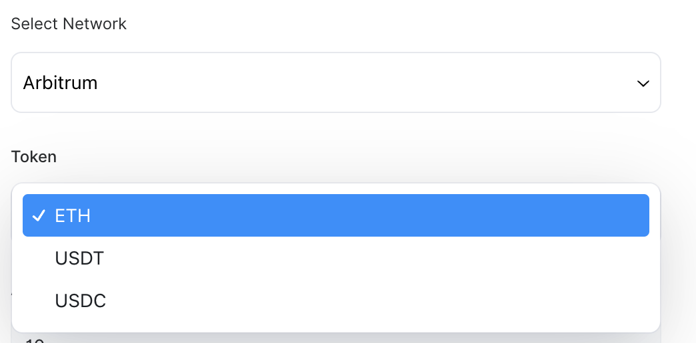
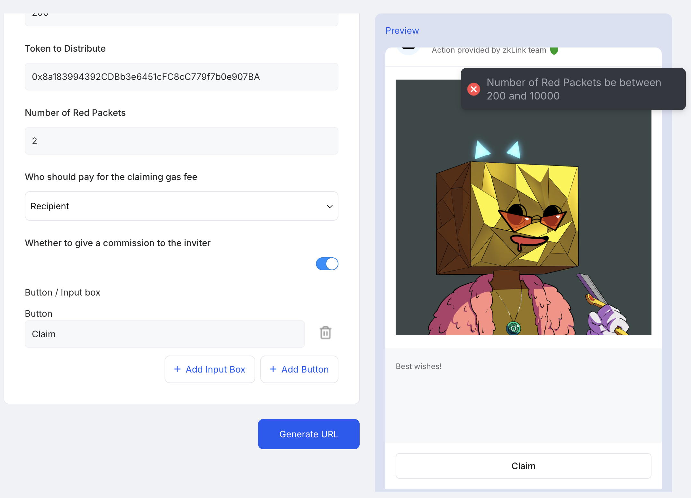

# zkLink Nova Actions & magicLink SDK

> [!NOTE]  
> Actions & magicLink is in beta and undergoing audit. Please [Contact Us](https://t.me/laniakeiaa) if you plan on going live with it.

Comprehensive Guide for Creating, Registering, and Utilizing Actions with MagicLinks in the zkLink Nova Network

## Overview

magicLink is a tool provided by zkLink that simplifies blockchain transactions into a shareable short link. With magicLink, users don’t need to understand complex blockchain operations. They can click the link, set a few simple parameters, and generate, preview, and sign the transaction, which can then be sent to various networks. This short link can easily be shared on social media or websites, making the user experience straightforward and smooth.

Key uses of magicLink:

- Simplified Transactions: Wrap complex on-chain operations into a simple link. Users click the link, enter parameters, confirm, and initiate a transaction.
- Cross-chain Support: magicLink handles transactions across multiple EVM-compatible networks. Users don’t need to worry about lacking tokens on a specific chain—this is managed in the background.
- Low Barrier of Entry: Users don’t need to understand the details of transactions; just simple inputs and clicks are enough to complete the process.
- Multiple Use Cases: Supports on-chain activities like token swaps, voting, and sponsorships.

Imagine you're building an on-chain voting dApp or a red packet dApp. Traditionally, beyond deploying smart contracts, you would need to develop and host front-end and back-end services, register domain names, and integrate with Twitter/Telegram for promotion. With magicLink, the development process is greatly simplified. You only need to focus on developing the Action. Once everything is ready, your dApp is essentially complete. Isn't that cool?

For developers, magicLink is created through the Action API, where you can define the business logic and customize the behavior based on the use case. magicLink provides a simple, efficient way to interact with the blockchain while giving users a seamless experience.

**Key Concepts**

- **action**: An action is a target implementation for developers and serves as the core functionality behind different MagicLinks. Simply put, it’s an abstract class that developers need to implement, which defines a standard interface for Action implementations. Through an Action, developers are required to set some necessary metadata, such as the `id`, `version`, `title`, `logo`, and `description`. Additionally, they need to guide how the magicLink constructs transactions. Actions also allow for defining data validation, displaying information to magicLink users, and more. We will go into further details in the following sections 
- **magicLink**: It is a shareable short link that serves as the entry point for executing an action. On the page of this short link, users can set a few parameters using selection boxes or input fields. After clicking confirm, they can generate and preview the transaction. If everything is correct, the user can sign and send it to the different networks. While on a website, a magicLink might immediately initiate a transaction preview in a wallet without redirecting users to a dApp. In Telegram, a bot can be used to expand a magicLink into an interactive set of buttons. In the future iteration, this function will be expanded to Discord. 

## Role
magicLink involves three key roles from development to sharing and usage:

- Developer: The role responsible for developing Actions. Developers need to implement the Action specifications and submit the code to the repository. We (zkLink) will register the reviewed Actions.
- Intent Creator: The role responsible for creating magicLinks. They select a registered Action, configure it, and generate a shareable short link.
- User: The person using the magicLink. Users do not need to understand complex transaction details; they can send transactions and participate in activities with simple inputs and clicks.


# Getting Started

## How It Works

The image below illustrates the flow from the user's transaction initiation to the core logic call of the **Action** created by the developer. The user initiates a request from the magicLink frontend. Since each magicLink is unique, when the backend service receives the request, it finds the corresponding **Action ID** from our **Action Registry** and retrieves the Action instance. At this point, the core functionality within the Action converts the parameters carried by the magicLink into a constructed transaction, which is then returned to the frontend. The frontend constructs the correct transaction and guides the user to send the transaction.


## Create an Action

Next, we will walk you through a real-world example: **Donation**. This will demonstrate, step by step, how to create a fully functional Action from scratch.

In this case, we will describe all the features and functionalities you might need as thoroughly as possible.


### 0. Prepare

We use _npm_ as package manager, _postgres_ database. We develop using _TypeScript_ and have chosen _NestJS_, a Node.js framework, as the foundational framework for our entire system. You will need a basic understanding of TypeScript and a general knowledge of NestJS's dependency injection and IoC (Inversion of Control).

To get started, ensure that Node and Postgres are installed locally. clone the repository:


```shell
git clone git@github.com:zkLinkProtocol/zklink-intent-url.git
```

Then install the dependencies:

```shell
npm install
```

Create a .env file from .env.example and make sure all necessary environment variables are correctly assigned. (DATABASE_*  WITNESS_PRIVATE_KEY)

```shell
cp .env.example .env
```

Create all db tables
```shell
npm run migration:run 
```

Start the local service.

```shell
npm run start:debug
```

From now you can start to develop your action.

### 1. Initialize

All Action implementations must be in the `libs` directory as a nest sub-project. So you must initiate your action project here. Run the following command:

```shell
npx nest g library my-action
```

According to the command line prompt
```shell
? What prefix would you like to use for the library (default: 
@app or 'defaultLibraryPrefix' setting value)? @action
```
enter **'@action'** and press _Enter_. You will see `nest-cli.json` in repository root is modified, and a new directory named `my-action` in the `libs` directory. This directory contains the basic structure of a nest project.

``` shell
# terminal output
CREATE libs/my-action/tsconfig.lib.json (223 bytes)
CREATE libs/my-action/src/index.ts (73 bytes)
CREATE libs/my-action/src/my-action.module.ts (203 bytes)
CREATE libs/my-action/src/my-action.service.spec.ts (475 bytes)
CREATE libs/my-action/src/my-action.service.ts (92 bytes)
UPDATE nest-cli.json (2000 bytes)
UPDATE package.json (4323 bytes)
UPDATE test/jest-e2e.json (1136 bytes)
UPDATE tsconfig.json (1855 bytes)

# generated files
libs/
│
├── tsconfig.lib.json
└── src/
    ├── index.ts
    ├── my-action.module.ts
    ├── my-action.service.ts
    └── my-action.service.spec.ts
```
Congratulations! You've successfully taken the first step.

### 2. Action Definition

Next, what you need to do next is to complete the development of the `Action` in the `my-action.service.ts` file. We provide an abstract class [`Action`](../src/common/dto/action.dto.ts) that you must extend to implement your action. 

```ts
import { Injectable } from '@nestjs/common';

import {
  Action,
  GenerateTransactionParams,
  TransactionInfo,
} from 'src/common/dto';

@Injectable()
export class MyActionService extends Action<T> {
  async getMetadata() {}

  async generateTransaction(
    data: GenerateTransactionParams<T>,
  ): Promise<TransactionInfo[]> {}
}
```

There are two abstract methods that must be implemented: `getMetadata` and `generateTransaction`. We'll start by adding placeholders for them. TypeScript will show errors, but don’t worry—we'll implement them later. The generic `T` will also be set to the correct type based on the needs of the action.

#### 2.1 ActionMetadata
Let's start by implementing `getMetadata`. It returns what appears to be a complex object literal of type `ActionMetadata<T>`. You can check the meaning of each field [here](../src/common/dto/action-metadata.dto.ts). 

```ts

async getMetadata() {
  return {
    title: 'Action Title',
    description:
      'This action allows you to create a magicLink... This is an action example description.',
    networks: [
      {
        name: 'Arbitrum',
        chainId: '42161',
      },
      {
        name: 'zkLink Nova',
        chainId: '810180',
      }
    ],
    author: { name: 'Action Author', github: 'https://github.com/zkLinkProtocol' },
    magicLinkMetadata: {
      description:
        'magicLink Enthusiast | Donate with your love for zkLink magic',
      title: 'This is a magicLink'
    },
    intent: {
      components: [
        {
          name: 'token',
          label: 'Token',
          desc: 'The token you want to cost',
          type: 'searchSelect',
          options: [
            {
              label: 'ETH',
              value: '',
              chainId: '42161',
              default: true,
            },
            {
              label: 'USDT',
              value: '0xFd086bC7CD5C481DCC9C85ebE478A1C0b69FCbb9',
              chainId: '42161',
            },
            {
              label: 'USDC',
              value: '0xaf88d065e77c8cC2239327C5EDb3A432268e5831',
              chainId: '42161',
            },
            {
              label: 'ETH',
              value: '',
              chainId: '810180',
              default: true,
            },
            {
              label: 'USDT',
              value: '0x2F8A25ac62179B31D62D7F80884AE57464699059',
              chainId: '810180',
            },
            {
              label: 'USDC',
              value: '0x1a1A3b2ff016332e866787B311fcB63928464509',
              chainId: '810180',
            },
            {
              label: 'ETH',
              value: '',
              chainId: '810181',
              default: true,
            },
            {
              label: 'USDT',
              value: '0x0efDC9f3948BE4509e8c57d49Df97660CF038F9a',
              chainId: '810181',
            },
            {
              label: 'USDC',
              value: '0xAC4a95747cB3f291BC4a26630862FfA0A4b01B44',
              chainId: '810181',
            },
            {
              label: 'ETH',
              value: '',
              chainId: '270',
              default: true,
            },
            {
              label: 'USDT',
              value: '0xDBBD57f02DdbC9f1e2B80D8DAcfEC34BC8B287e3',
              chainId: '270',
            },
            {
              label: 'USDC',
              value: '0x09B141F8a41BA6d2A0Ec1d55d67De3C8f3846921',
              chainId: '270',
            },
          ],
        },
        {
          name: 'value',
          label: 'Amount',
          desc: 'The amount to sponsor',
          type: 'input',
          regex: '^\\d+\\.?\\d*$|^\\d*\\.\\d+$',
          regexDesc: 'Must be a number',
        },
        {
          name: 'recipient',
          label: 'Recipient',
          desc: 'The address that is sponsored',
          type: 'input',
          regex: '^0x[a-fA-F0-9]{40}$',
          regexDesc: 'Invalid address',
        },
      ],
      preset: [
        {
          field: 'value',
          title: 'Donate 0.01 ETH',
          type: 'Button',
          value: '0.01',
        },
      ],
    },
  }
};
```

Now, follow along with me as we explore each field in the metadata and understand its meaning in conjunction with the UI.

The left side of this image is the magicLink creation area, and the right side is the magicLink preview area, where creators can create their own magicLink by setting and modifying metadata.

The metadata defined above will be reflected in the corresponding UI controls on the frontend and the highlighted fields correspond to the metadata object literals you defined.

<div align="center">
 
</div>


I will provide further explanations for some fields that need clarification.

- *networks*: It is an array, indicating which network the target chain of the created magicLink belongs to. For example, you allow the creation of a donation link, enabling users to donate to you on Ethereum, and also allow the creation of a magicLink for donations on the Arbitrum network

  <div align="center">
  
  </div>
- *magicLinkMetadata*: You can set the default values for the magicLink's title, main image, and description here, as shown in the image above. You might be curious about where to set this main image. There are two ways to set it: you can explicitly set the 'gallery' field, whose value is a URL of an image accessible over the internet. Alternatively, you can set it implicitly by uploading an image with the same name as the id in the assets/galleries directory. We will help you upload it to S3 and set it as the value for the `gallery`. Therefore, the default image in the preview section of the magicLink above is because there is an image in assets/galleries with the same name as the id.
  ```ts
  // 1. explicitly
  magicLinkMetadata: {
    description:
      'magicLink Enthusiast | Donate with your love for zkLink magic',
    title: 'This is a magicLink',
    gallery: 'https://zklink-nova-nft.s3.ap-northeast-1.amazonaws.com/cuboimage-test/193.png'
  }

  // 2. implicitly
  magicLinkMetadata: {
    description:
      'magicLink Enthusiast | Donate with your love for zkLink magic',
    title: 'This is a magicLink',
  }
  // main image location
  assets/
  │
  └── galleries/
      ├── my-action.png
      ├── ...
  ```
- *components*: The fields defined here are generally those that you need the **creator** to flexibly fill in. These parameters will eventually be passed in as part of the arguments in `generateTransaction` and used flexibly for constructing transactions or making conditional judgments and etc.
  
  Among them, it can be of various types such as input (allowing user input), text (fixed display parameters), or select (dropdown menu selection).

  If the type is 'select', it will have `options`, which are the choices in the dropdown menu. There are two required fields: `label` & `value` - label is used for menu display, and value acts as the value for `name`. There are two optional items: `chainId`, which specifies that this option is only selectable when the same chainId is selected in `networks`, and `default
  : true` indicates that it is the default selected value.

  <div align="center">
    
  </div>

- preset: 
This field presets the default trigger for the magicLink. `field` refers to the name of a specific `name`, `value` is the value of `name`, `title` is used for display, and `type` can be set to either 'Button' or 'Input'.

  <div align="center">
    
  </div>

#### 2.2 generateTransaction
Another function that must be implemented is `generateTransaction`, whose return data type is [`TransactionInfo[]`](../src/common/dto/transaction.dto.ts#57). When a user clicks the **0.001ETH** button on the magicLink page, the `TransactionInfo[]` will be sequentially constructed into on-chain transactions and sent to the network.

It is necessary to delve into the parameters of GenerateTransactionParams here
```ts
export type GenerateTransactionParams<
  T extends Record<string, any> = Record<string, any>,
> = {
  additionalData: AdditionalParams;
  formData: GenerateFormParams<T>;
};

type AdditionalParams = {
  chainId: string; // Network chain ID
  code?: string; // magicLink code, a unique 8-character random string
  account?: string; // the user address that initiates the transaction.
  inviter?: string;
};
```
  - code: You can leverage the code with the contract or your external service for deep binding, where each magicLink has a unique and unrepeatable code.
  - inviter: The inviter is a field used to handle invitation-related information. When users share the magicLink, they include their address as the inviter. If your action has a sharing commission feature, you can incorporate the inviter into your contract to implement the logic.
  - formData: It is the component you define in the component, and it is the raw form data used to construct the transaction.
Next, we will implement a straightforward generateTransaction method

```ts
async generateTransaction(
    data: GenerateTransactionParams,
): Promise<TransactionInfo[]> {
  // Build and return your transaction
   const { formData } = data;
  const tx = {
    chainId: 810180,
    to: formData.recipient,
    value: formData.value,
    data: '0x',
  }
  return [tx];
}
```
As you can see, the simplest version of `TransactionInfo` only needs to define 4 fields related to the transaction. There are also 3 unused fields here, which are useful in certain scenarios and require further introduction to you.

- _shouldPublishToChain_: In most cases where a user needs to send an on-chain transaction, this field needs to be set to true.
- _customData_: If you are familiar with [paymaster](https://docs.zksync.io/build/start-coding/zksync-101/paymaster), then you will be quite accustomed to this. [Learn how to send a transaction through a paymaster](https://docs.zksync.io/build/start-coding/quick-start/paymasters-introduction#how-to-send-a-transaction-through-a-paymaster) 
- _requiredTokenAmount_: magicLink has the capability to allow developers to implement **Nova cross-chain** functionality with simple configurations. For example, the aforementioned transaction occurs on the Arbitrum chain, but if you want to allow users to attempt a cross-chain transfer of a corresponding amount of tokens from the Nova network when they do not have enough tokens on Arbitrum, you only need to configure this parameter, and it will try to execute the corresponding cross-chain request.
  ```ts
  async generateTransaction(
      params: GenerateTransactionParams,
  ): Promise<TransactionInfo[]> {
    // Build and return your transaction
    const tx = {
      chainId: 42161, // arbitrum chain ID
      to: params.recipient,
      value: params.value,
      data: '0x',
      requiredTokenAmount: [{
        token: params.token,
        amount: params.value,
      }]
    }
    return [tx];
  }
  ```
#### 2.3 Registry an action

After the above steps, you have created a simple action. The final, we need to register it in our registry so that the system can properly run this action's functionality.

We provide the `RegistryPlug` decorator, which requires two input parameters: args[0] is the action ID, and args[1] is the version number.

The **action ID** should follow the snake-case naming convention and match the name used in the command `npx nest g library my-action`, which is the name of your Action folder. This ensures that it is unique and does not conflict with other actions. This ID will be used as a runtime index throughout the system, guiding the runtime code to load and execute the Action. **Keep the naming consistent and do not allow further modifications.**

The **version** represents the version of your action, and the version number should start from `v1`. Each time you upgrade the action, increment the version by 1. For example, the initial submission of the action should be version `v1`. If you upgrade the action multiple times in the future, the version number should be updated to **v2**, **v3**, **v4**, and so on. For upgrading an action, please refer to the [Action Upgrade](#2-how-do-i-update-or-upgrade-an-action) section.

```typescript
// my-action.module.ts
import { Module } from '@nestjs/common';

import { MyActionService } from './my-action.service';

@Module({
  providers: [MyActionService],
  exports: [MyActionService],
})
export class MyActionModule {}


// my-action.service.ts
@RegistryPlug('my-action', 'v1')
@Injectable()
class MyActionService extends ActionDto<FormName> {
  ...
}
```
In the `libs` folder, we have defined the `RegistryPlug` decorator. Additionally, we have defined the `Registry Module`. This module acts as a registry for all the actions developed by developers. It uses NestJS's IoC to inject all the actions into our application, making them effective.

The application will scan all action classes decorated with **RegistryPlug** in the **registry module**. It will register the action IDs into the application and use the highest version number for each ID as the currently available action for the **intent creator**. Meanwhile, for *already* created magic links, they will continue to use their originally corresponding version number.

```typescript
@Module({
  imports: [
    MyActionModule,
    ... // other actions
  ]
  providers: [RegistryService],
  exports: [RegistryService],
})
export class RegistryModule {}
```

Our framework will register your Action implementation into the routing system. When a request arrives, it will locate your Action implementation based on your ID, pass in the parameters, and execute your business logic, ultimately generating a transaction for the user to sign and send.

### 3. Advanced Methods

- The `validateFormData` method allows developers to create more flexible validation rules. It takes `validateFormData` as input and returns a string containing error messages. When the frontend creates an magicLink, the parameters passed can be validated against custom rules using this hook function. If an error message is returned, the frontend will display it.

  ```ts
  // amountIn and recipient are parameters input by the intents component
  // pseudocode below: 
  async validateFormData(formData: GenerateFormParams<FormData>): Promise<ErrorMessage> {
    const { amountOfRedEnvelopes } = formData
   if (
      Number(amountOfRedEnvelopes) < 200 ||
      Number(amountOfRedEnvelopes) > 10000
    ) {
      return 'Number of Red Packets should be between 200 and 10000';
    }
    return ''; // no error message
  }
  ```
  <div align="center">
    
  </div>
  
- The `reloadAdvancedInfo` optional function processes real-time contract information that should be displayed to users through the magicLink. 

  For example, for a red packet contract, it might show something like _"There are 20 red packets in total, and 3 red packets have been claimed."_  Developers can use this method to return a title and a HTML string based on the contract's view function, making it easier for users to refresh and view the information. 

  After the developer defines the title and html content, the display in the magicLink will be similar to the part highlighted in red in the image
  
   ```ts
  // You can obtain status information from the contract or through other APIs and return the results
  // pseudocode below: 
  async reloadAdvancedInfo(data: BasicAdditionalParams): Promise<{ title: string; content: string }> {
    const price = await fetchApi('price')
    const marketCap = await fetchApi('marketCap')
    return {
      title: 'Token Info'
      content: `<p>price: ${price}<p><p>Market Cap: ${marketCap}</p>`
    }
  }
  ```
  <div align="center">
    
  </div>

- **magicLink binds to on-chain transactions**. After creating the magicLink, it may not become active immediately and you need to initiate one or more transactions on-chain before you can create an active magicLink. For example, with a red packet contract, you need to deposit a red packet asset into the contract before the magicLink can become active. This way, users can claim the red envelope created through your magicLink.

  The `onMagicLinkCreated` provides this capability. It returns `TransactionInfo[]`. Its signature is the same as `generateTransaction`, but it is an on-chain transaction executed immediately after the magicLink is created.

  <div align="center">
    
  </div>

  In the image above, we can see that after creating a magicLink, the transaction returned by `onMagicLinkCreated` is constructed and sent as an on-chain transaction.

- `preCheckTransaction`, the magicLink is not always available to users. Imagine a scenario where you expect users to participate in a vote only once through the magicLink. Therefore, when loading the magicLink, you need to query the on-chain information to check if the user has already voted. If they have voted, this function should return a message to inform the user of the reason they cannot vote again.
  ```ts
  // pseudocode

   public async preCheckTransaction(
    data: GenerateTransactionParams<FieldTypes>,
  ) {
    const { additionalData } = data;
    const { code, account } = additionalData;
    if (!code) {
      throw new Error('missing code');
    }
    const hasVoted = this.contract.queryVotedStatus(code, account);
    if (hasVoted) {
      return 'You has already voted';
    } else {
      return '';
    }
  }

  ```
- `reportTransaction` is similar to preCheckTransaction above, this function also returns a message to politely inform the user of the result of their transaction after it has completed.
  ```ts

  async reportTransaction(
    data: GenerateTransactionParams<FieldTypes>,
    txHash: string,
  ): Promise<ErrorMessage> {
      const { formData } = data;
      const { distributionToken } = formData;
      const iface = new Interface(RedPacketABI);
      const eventTopic = ethers.id('RedPacketClaimed(uint256,address,uint256)');
      try {
        const receipt = await this.provider.getTransactionReceipt(txHash);
        if (!receipt) {
          throw new Error('wrong transaction hash');
        }
        const log = receipt.logs.find((log) => {
          return log.topics[0] === eventTopic;
        });
        if (!log) {
          throw new Error('parse log error');
        }
        const event = iface.parseLog(log);
        const { amount } = event?.args ?? { amount: 0n };
        const decimals = await this.getDecimals(distributionToken);
        const symbol = this.getTokenNameByAddress(distributionToken);
        const claimedAmount = formatUnits(amount.toString(), decimals);
        return `You have received ${claimedAmount} ${symbol} in red packet amount!`;
      } catch (error) {
        throw new Error(`Failed to fetch transaction receipt: ${error.message}`);
      }
    }
  ```
  The above reportTransaction function politely informs the user of the successful outcome after they have successfully claimed the red envelope through the magicLink

### 4. Switch `env`
We offer two environment variables, `dev` and `prod`, that allow you to configure contract addresses or settings for both environments. The env variable for the **dev** branch is set to `dev`, while the env variable for the **main** branch is set to `prod`. In the **dev** branch, you can test with the test-network's magicLink, and once the code is merged into the main branch, it will read the mainnet network's contract configurations.

Here's how you can implement this:

1. Create a config.ts file:
```typescript
export const config = {
  dev: {
    chainId: 810181,
    rpcUrl: 'https://sepolia.rpc.zklink.io',
    quoterContractAddress: '0x86Fc6ab84CFc6a506d51FC722D3aDe959599A98A',
  },
  prod: {
    chainId: 810180,
    rpcUrl: 'https://rpc.zklink.io',
    quoterContractAddress: '0x23Fc6ab84CFc6a506321FC722D3aDe959599A901',
  },
} as const;
```

2. Read the env using NestJS DI:

```typescript
@Injectable()
export class RedEnvelopeService extends ActionDto {
  constructor(readonly configService: ConfigService) {
    const env = configService.get('env', { infer: true })!;
    this.config = config[env];
  }
}
```
This setup ensures that your Actions uses the correct configuration based on the environment it is running in.


### 5. Submit

After implementing your action, you need to submit a PR to the repository. We will review your code and consider whether to accept it.

## Example

The [buy-me-a-coffee](../libs/buy-me-a-coffee/) and [`novaswap`](../libs/novaswap/) Actions are good examples for you to learn how to implement an action.

## How to debug your action
All of the metadata configurations and function implementations mentioned above are designed to build the frontend UI and on-chain transactions.

If you want to conveniently use local actions, create magic links, and initiate transactions through the magic links during the action development process, you can follow these steps.

1. Use the VSCode debug terminal

<div align="center">
  
</div>

2. Ensure that the .env file is configured correctly so that the program can run properly, with a focus on the database configuration and run `npm run migration:run`

    ```
    DATABASE_HOST=
    DATABASE_USER=
    DATABASE_PASSWORD=
    DATABASE_NAME=
    ```
    run command
    ```
    npm run migration:run
    npm run start:debug
    ```
3. Set breakpoints in the code area.
<div align="center">
  
</div>

4. Access the magicLink [dev dashboard](https://zklink.io/dashboard/) page using a browser, open the browser console, and type in the console `localStorage.setItem('baseUrl', 'http://localhost:4101/api')`. After refreshing the browser, all service requests will be directed to http://localhost:4101/api. Note that `4101` should match the `PORT` in your local .env file.

    Next, log back into the dashboard using MetaMask or Passkey, create a magicLink, and initiate a transaction using the magicLink. All this data will be stored in your local database.

    Be sure to check the requests in the browser's network tab to see if they are reaching the local port service; if not, set the `localStorage`.

## Tips and Tricks

### Keep it Simple

Our Action interface offers flexibility, allowing you to implement TypeScript business logic according to your requirements. However, please ensure that your logic implementation remains as straightforward as possible.

### Use Industry-Standard Libraries

While you may introduce new dependencies, please ensure that you use industry-standard libraries.

### Minimize External Dependencies

You are permitted to reference external API services with caution. During the code review process, we will consider the impact on our business operations. The preferred approach is to avoid relying on external API services and, if necessary, to only obtain essential data from the zkLink Nova blockchain.

### Prioritize Security

Security is our top priority. Minimizing dependencies and external services enhances the robustness of our service. This will be a key criterion in our evaluation of your Action implementation.


## FAQs

### 1. How to set the logo and main image for the magicLink.

You have two ways to set it. One is to set it directly in the metadata as literals, under `logo` and `magicLinkMetadata.gallery` for the logo and the main image of the magicLink, respectively. The other way is to upload images with the same action id in the 'assets' directory at the root."


### 2. How do I update or upgrade an action?

Whether you update or upgrade your action depends on which part of the logic you have modified. It is crucial to consider "**whether the changes impact the creation of on-chain transactions**".

If you are making changes such as correcting typos, updating titles, logos, or adding a few options without affecting the core logic of `generateTransaction`, then it is considered an **update**.

However, if the changes affect the core logic of `generateTransaction`—for example, if version 1 requires casting 1 vote per transaction and now version 2 enforces casting 5 votes per transaction—then it constitutes an **upgrade**.

Follow these steps:

1. Modify Your Code: Make the necessary changes to your action implementation.
Test Thoroughly: Ensure all changes are thoroughly tested, including unit, integration, and manual tests:
  
    - **update**: Directly modifying the code logic without changing the version number in the `RegistryPlug` decorator.
    - **upgrade**: Upgrade the version number to the next number. And you can cleverly use TypeScript's inheritance capabilities to override any core methods in the V1 Action class.

    ```typescript
      @RegistryPlug('my-action', 'v1')
      @Injectable()
      class MyActionService extends Action {
        async private getSignature() {
          ...
        }

        async public generateTransaction() {
            const signature = await this.getSignature()
            ...
        }
      }

      @RegistryPlug('my-action', 'v2')
      @Injectable()
      class MyActionServiceV2 extends Action {
        async private getSignature() {
          console.log('enhanced functionality')
          ... // original logic
          console.log('another enhanced functionality')
        }

        async public generateTransaction() {
            const signature = await this.getSignature()
            ...
        }
      }
    ```
    The above `MyActionServiceV2` inherits most of the functionality from `MyActionService`, but overrides the `getSignature` method. It's that simple — just a small amount of code allows you to easily upgrade to a new version of an action.

    Finally, don't forget to register the new version of the action.

    ```typescript
      @Module({
        providers: [
          MyActionService, // KEEP the old version action!!!
          MyActionServiceV2,
          ... // other actions
        ],
        exports: [
          MyActionService,
          MyActionServiceV2,
          ... // other actions
        ],
      })
      export class RegistryModule {}
      ```

    
2. Submit a Pull Request (PR): Create a PR with a detailed description of the changes and the reasons for the update.
3. Code Review: The zkLink team will review your PR for quality, security, and compliance with standards.
4. Approval and Registration: Once approved, your updated action will be registered and available for use. <font color="red">The action-id cannot be changed arbitrarily; it will remain fixed and unchanged</font>


### 3. What if my action requires external data?

Minimize reliance on external APIs. If necessary, use them cautiously and ensure they do not impact business operations.

### 4. What is the submission and review process for new actions?

1. Submit a PR: Follow the repository's guidelines for submitting a pull request.
2. Code Review: Your code will be reviewed for quality, security, and compliance with standards.
3. Approval: Once approved, your action will be registered and available for use.

## Glossary

1. Action: A standardized API implementation for generating transactions.
2. magicLink: A shareable link for executing actions on the zkLink Nova network.
3. Swagger: A tool for testing and verifying APIs.
